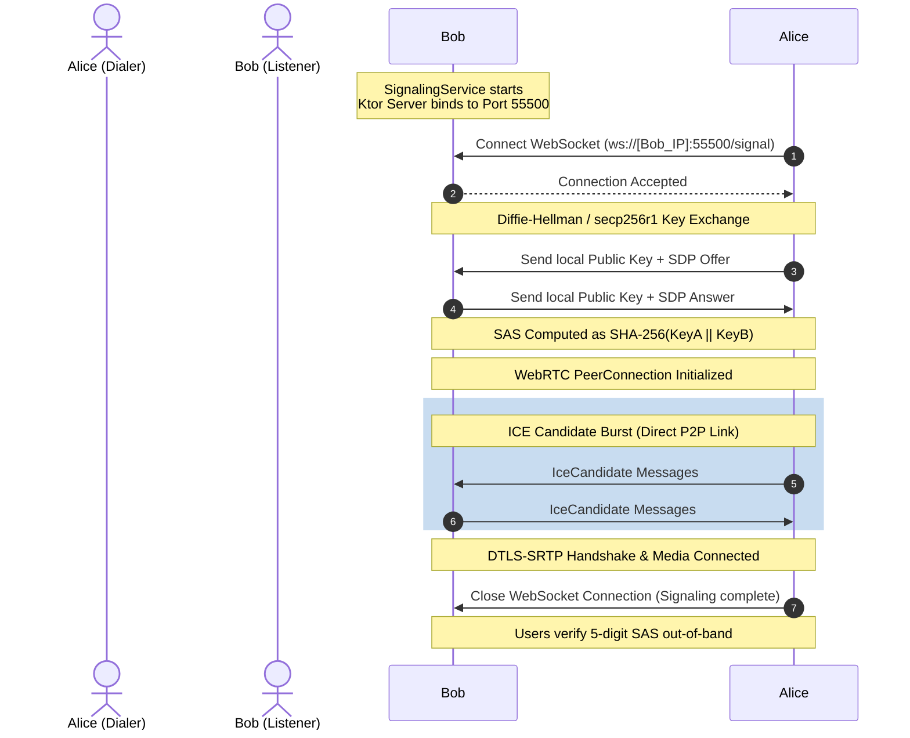

# Architectural Design & Deep Dive

This document details the architectural decisions, module interactions, signaling sequence, and security controls within the `PrivateCallingApp`.

---

## 🏗️ Multi-Module Architecture

The project is structured with a strict dependency graph where feature modules are completely isolated from one another and communicate through core infrastructure layers:

```mermaid
graph TD
    subgraph Feature Layer
        app[":app (MainActivity, Navigation)"]
        contacts[":feature-contacts (Peer List)"]
        call[":feature-call (Call Screen UI)"]
    end

    subgraph Core Layer
        storage[":core-storage (Room DB)"]
        crypto[":core-crypto (Android Keystore, SAS)"]
        media[":core-media (WebRTC, Hardware Capturer)"]
        network[":core-network (Ktor WS Client/Server)"]
    end

    app --> contacts
    app --> call
    
    contacts --> storage
    contacts --> crypto
    
    call --> media
    call --> network
    call --> crypto
    call --> storage
    
    media --> network
    storage --> crypto
```

### Module Responsibilities
- **`:app`**: Assembles the Dagger Hilt dependency graph, manages navigation, and defines the theme.
- **`:feature-contacts`**: Presents the user directory. Operates independently from call management.
- **`:feature-call`**: Renders local/remote WebRTC camera views and handles active calling state transitions.
- **`:core-storage`**: Provides database entities for saving verified peers, addresses, and public keys.
- **`:core-crypto`**: Manages asymmetric key generation, hardware key storage (Android Keystore), and SAS validation calculations.
- **`:core-media`**: Orchestrates local media capture, WebRTC initialization, and hardware audio controls (AEC, AGC, NS).
- **`:core-network`**: Implements direct WebSocket client/server tunnels for serverless WebRTC signaling.

---

## 📞 Call Signaling Sequence

Because the application is serverless, the calling device opens a direct connection to the target device's signaling server to negotiate the session.



---

## 🔒 Security Model

### Asymmetric Identity Pinning
To prevent spoofing or tampering, each client generates a unique `secp256r1` keypair inside the hardware-backed **Android Keystore** upon the first launch. 
- The private key never leaves the hardware boundary.
- During signaling, the public key is exchanged and pinned in Bob's database against Alice's IP/hostname.
- Subsequent calls verify that the peer's public key matches the pinned key.

### Short Authentication String (SAS)
To eliminate Man-in-the-Middle (MITM) attacks on the signaling channel:
1. Public keys are concatenated in a deterministic byte order.
2. A `SHA-256` hash is calculated over the concatenated keys.
3. The resulting hash is mapped to a 5-digit string formatted with Western numerals (`Locale.US`).
4. Since the audio/video stream is secured via `DTLS-SRTP` using key fingerprints exchanged over the signaling channel, verification of the SAS guarantees that the signaling stream was not intercepted.

---

## 🔋 Battery & Threading Guidelines

- **Coroutines**: All background networking, WebRTC socket exchanges, and database writes run on `Dispatchers.IO` scoped to lifecycle-aware contexts (`viewModelScope` or explicit `SupervisorJob` scopes that are terminated on service/client shutdown).
- **Keep-Alives**: Ktor WebSocket connections enforce a 15-second keep-alive ping and a 30-second connection timeout (`pingPeriodMillis` and `timeoutMillis`), preventing dead-socket retention and battery drain on idle threads.
